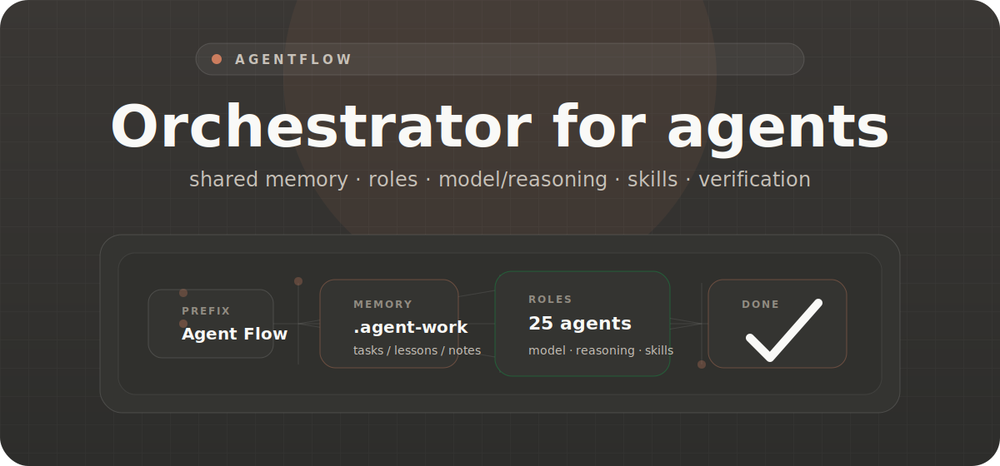
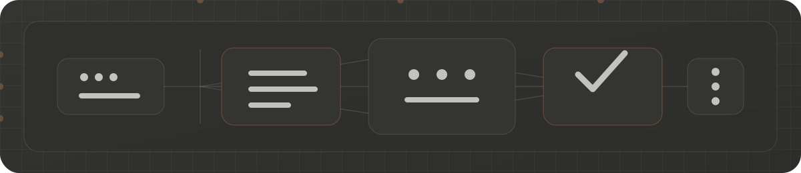
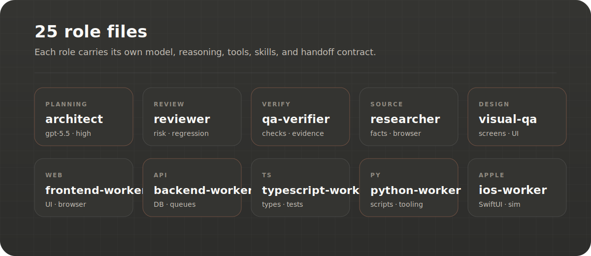

<p align="center">
  <picture>
    <source media="(prefers-color-scheme: dark)" srcset="docs/assets/readme/agentflow-hero-en.svg">
    <source media="(prefers-color-scheme: light)" srcset="docs/assets/readme/agentflow-hero-en.svg">
    
  </picture>
</p>

<h1 align="center">Orchestrator for agent teams</h1>

<p align="center">
  AgentFlow is a Codex skill for tasks where the main agent keeps project memory, selects roles, controls delegation, and returns verified output.
</p>

<p align="center">
  <b>shared memory</b> · <b>25 roles</b> · <b>model/reasoning per agent</b> · <b>skills per role</b> · <b>no silent install</b>
</p>

<div align="center">

[](agents)
[](registries/agent-skills.json)
[](references/project-memory-and-env.md)
[](LICENSE)

</div>

<p align="center">
  <a href="README.md">RU</a> · <a href="README.en.md"><b>EN</b></a>
</p>

<br/>

<h2 align="center">Contract</h2>

<p align="center">
  AgentFlow runs only when the request starts with an invocation prefix. Prefix does not authorize subagents.
</p>

```text
Agent Flow <task>
$agent-flow <task>
agent-flow <task>
```

<p align="center">
  Delegation needs a separate explicit request in the same task: <code>use subagents</code>, <code>spawn a subagent</code>, <code>multi-agent review</code>.
</p>

<p align="center">
  <picture>
    <source media="(prefers-color-scheme: dark)" srcset="docs/assets/readme/agentflow-process.svg">
    <source media="(prefers-color-scheme: light)" srcset="docs/assets/readme/agentflow-process.svg">
    
  </picture>
</p>

<br/>

<h2 align="center">Contents</h2>

| Component | Purpose |
| --- | --- |
| `.agent-work/tasks/` | shared memory: todo, lessons, implementation notes, verification, handoff |
| `agents/*.md` | 25 narrow role files |
| `model`, `reasoning_effort` | model and reasoning per role |
| `escalation_triggers` | stronger config for risky tasks |
| `skills` | skills required by a role |
| `registries/agent-skills.json` | install metadata for role skills |
| `references/` | budgets, flows, delegation, traceable runs, Definition of Done |
| `scripts/` | resolver, validators, trace helpers, dependency checker |

<p align="center">
  <picture>
    <source media="(prefers-color-scheme: dark)" srcset="docs/assets/readme/agentflow-agents.svg">
    <source media="(prefers-color-scheme: light)" srcset="docs/assets/readme/agentflow-agents.svg">
    
  </picture>
</p>

<br/>

<h2 align="center">Install</h2>

```bash
git clone https://github.com/svishniakov/agent-flow.git ~/.codex/skills/agent-flow
python3 ~/.codex/skills/agent-flow/scripts/check-agent-deps.py --post-install
```

<p align="center">
  <code>--post-install</code> shows missing skills and recommends <code>core</code>. No silent install.
</p>

<h3 align="center">Environment check</h3>

```bash
python3 scripts/check-agent-deps.py
python3 scripts/check-agent-deps.py --scope core
python3 scripts/check-agent-deps.py --scope role:typescript-worker
python3 scripts/check-agent-deps.py --strict
```

<h3 align="center">Skill install plan</h3>

```bash
python3 scripts/check-agent-deps.py --scope core --install-plan
python3 scripts/check-agent-deps.py --scope full --install-plan --target project
python3 scripts/check-agent-deps.py --scope core --guided-install
```

<h3 align="center">Repo checks</h3>

```bash
python3 -m py_compile scripts/*.py
python3 scripts/validate-agent-config.py
python3 scripts/validate-agent-skill-registry.py
python3 scripts/validate-run.py --help
```

<br/>

<h2 align="center">Prompts</h2>

**Solo**

```text
Agent Flow Read the repository, project memory, and README. Return active, blocked, next actions, risks. Do not change anything.
```

**Bugfix**

```text
Agent Flow Investigate this bug: <description>. Find the cause, make the smallest fix, run checks, return changed files and risks.
```

**Subagents**

```text
Agent Flow Use subagents for independent review. Split work by role and merge findings into one result.
```

<br/>

<p align="center">Apache 2.0 · <a href="LICENSE">LICENSE</a></p>
