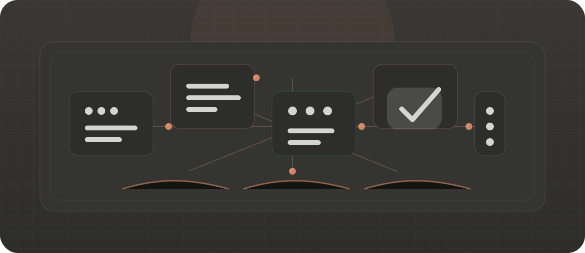

# AgentFlow

<p align="center">
  <a href="README.md"><b>RU</b></a> · <a href="README.en.md">EN</a>
</p>

<p align="center">
  
</p>

<h1 align="center">Навык для управляемой работы агентов</h1>

<p align="center">
  общая память · оркестратор · 25 ролей · model/reasoning на агента · skills на роль
</p>

<p align="center">
  
  
  
  
</p>

## Контракт

AgentFlow включается только в начале запроса:

```text
Agent Flow <задача>
$agent-flow <задача>
agent-flow <задача>
```

Без префикса навык не используется.

Префикс не разрешает субагентов. Делегирование включается только отдельной явной просьбой в той же задаче: «используй субагентов», `spawn a subagent`, `multi-agent review`.

## Что есть внутри

| Компонент | Назначение |
| --- | --- |
| `.agent-work/tasks/` | общая память: todo, lessons, implementation notes, проверки |
| `agents/*.md` | роли субагентов и их machine-readable config |
| `model` | модель для роли |
| `reasoning_effort` | уровень reasoning для роли |
| `escalation_triggers` | условия перехода на сильнее config |
| `skills` | skills, которые нужны конкретной роли |
| `registries/agent-skills.json` | install metadata для role skills |
| `references/` | бюджеты, flows, delegation, traceable runs, Definition of Done |
| `scripts/` | resolver, validators, trace helpers, dependency checker |

## Роли

В `agents/` лежат 25 ролей. Каждая роль имеет узкую зону ответственности, свой набор skills, свои настройки модели и reasoning.

Примеры ролей:

- `architect`
- `reviewer`
- `qa-verifier`
- `researcher`
- `frontend-worker`
- `backend-worker`
- `typescript-worker`
- `python-worker`
- `ios-worker`
- `visual-qa`

## Установка

```bash
git clone https://github.com/svishniakov/agent-flow.git ~/.codex/skills/agent-flow
python3 ~/.codex/skills/agent-flow/scripts/check-agent-deps.py --post-install
```

`--post-install` показывает missing skills и рекомендует `core` набор. Ничего не ставит молча.

## Проверка

```bash
python3 scripts/check-agent-deps.py
python3 scripts/check-agent-deps.py --scope core
python3 scripts/check-agent-deps.py --scope role:typescript-worker
python3 scripts/check-agent-deps.py --strict
```

План установки skills:

```bash
python3 scripts/check-agent-deps.py --scope core --install-plan
python3 scripts/check-agent-deps.py --scope full --install-plan --target project
python3 scripts/check-agent-deps.py --scope core --guided-install
```

Проверки repo:

```bash
python3 -m py_compile scripts/*.py
python3 scripts/validate-agent-config.py
python3 scripts/validate-agent-skill-registry.py
python3 scripts/check-agent-deps.py --scope core
python3 scripts/init-run.py --help
python3 scripts/append-timeline.py --help
python3 scripts/record-agent-trace.py --help
python3 scripts/validate-run.py --help
```

## Примеры

Одиночная работа:

```text
Agent Flow Прочитай репозиторий, память проекта и README. Верни активные задачи, блокеры, следующие действия и риски. Ничего не меняй.
```

Баг:

```text
Agent Flow Разбери баг: <описание>. Найди причину, исправь минимально, запусти проверки, верни изменённые файлы и риски.
```

Субагенты:

```text
Agent Flow Используй субагентов для независимого ревью текущей реализации. Раздели работу по ролям и сведи находки в один итог.
```

## Лицензия

Apache 2.0. См. [LICENSE](LICENSE).
