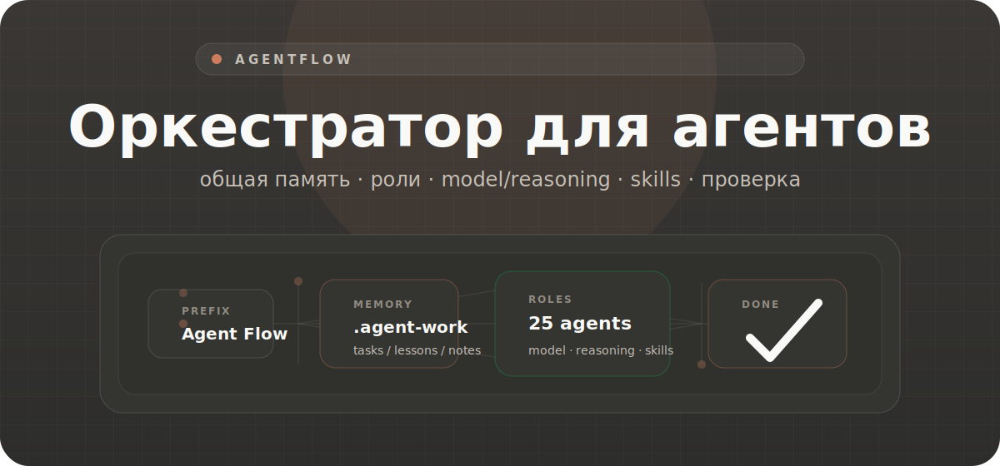

<p align="center">
  <picture>
    <source media="(prefers-color-scheme: dark)" srcset="docs/assets/readme/agentflow-hero-ru.svg">
    <source media="(prefers-color-scheme: light)" srcset="docs/assets/readme/agentflow-hero-ru.svg">
    
  </picture>
</p>

<h1 align="center">Оркестратор для команды агентов</h1>

<p align="center">
  AgentFlow — Codex skill для задач, где главный агент держит память проекта, выбирает роли, управляет делегированием и возвращает проверенный результат.
</p>

<p align="center">
  <b>общая память</b> · <b>25 ролей</b> · <b>model/reasoning на агента</b> · <b>skills на роль</b> · <b>no silent install</b>
</p>

<div align="center">

[](agents)
[](registries/agent-skills.json)
[](references/project-memory-and-env.md)
[](LICENSE)

</div>

<p align="center">
  <a href="README.md">EN</a> · <a href="README.ru.md"><b>RU</b></a>
</p>

<br/>

<h2 align="center">Контракт</h2>

<p align="center">
  AgentFlow включается только ведущим префиксом. Префикс не разрешает субагентов.
</p>

```text
Agent Flow <задача>
$agent-flow <задача>
agent-flow <задача>
```

<p align="center">
  Для делегирования нужна отдельная просьба в той же задаче: <code>use subagents</code>, <code>spawn a subagent</code>, <code>multi-agent review</code>.
</p>

<p align="center">
  <picture>
    <source media="(prefers-color-scheme: dark)" srcset="docs/assets/readme/agentflow-process.svg">
    <source media="(prefers-color-scheme: light)" srcset="docs/assets/readme/agentflow-process.svg">
    
  </picture>
</p>

<br/>

<h2 align="center">Большие PRD</h2>

<p align="center">
  Если пользователь явно разрешил субагентов, AgentFlow может разложить большой scope на lanes: implementation, integration, QA и review. Для traceable runs source of truth — <code>lane-map.json</code>; <code>validate-run.py</code> блокирует <code>Verdict: ship</code>, если critical lane не закрыта evidence или валидной replacement lane.
</p>

<br/>

<h2 align="center">Что внутри</h2>

| Компонент | Назначение |
| --- | --- |
| `.agent-work/tasks/` | общая память: todo, lessons, implementation notes, verification, handoff |
| `agents/*.md` | 25 role files с узкой специализацией |
| `model`, `reasoning_effort` | индивидуальная модель и reasoning на роль |
| `escalation_triggers` | переход на сильнее config при риске |
| `skills` | skills, которые нужны конкретной роли |
| `registries/agent-skills.json` | install metadata для role skills |
| `references/` | budgets, flows, delegation, traceable runs, Definition of Done |
| `scripts/` | resolver, validators, trace helpers, dependency checker |

<p align="center">
  <picture>
    <source media="(prefers-color-scheme: dark)" srcset="docs/assets/readme/agentflow-agents.svg">
    <source media="(prefers-color-scheme: light)" srcset="docs/assets/readme/agentflow-agents.svg">
    
  </picture>
</p>

<br/>

<h2 align="center">Установка</h2>

```bash
git clone https://github.com/svishniakov/agent-flow.git ~/.codex/skills/agent-flow
python3 ~/.codex/skills/agent-flow/scripts/check-agent-deps.py --post-install
```

<p align="center">
  <code>--post-install</code> показывает missing skills и рекомендует <code>core</code>. Ничего не ставит молча.
</p>

<h3 align="center">Проверка окружения</h3>

```bash
python3 scripts/check-agent-deps.py
python3 scripts/check-agent-deps.py --scope core
python3 scripts/check-agent-deps.py --scope role:typescript-worker
python3 scripts/check-agent-deps.py --strict
```

<h3 align="center">План установки skills</h3>

```bash
python3 scripts/check-agent-deps.py --scope core --install-plan
python3 scripts/check-agent-deps.py --scope full --install-plan --target project
python3 scripts/check-agent-deps.py --scope core --guided-install
```

<h3 align="center">Проверки repo</h3>

```bash
python3 -m py_compile scripts/*.py
python3 scripts/validate-agent-config.py
python3 scripts/validate-agent-skill-registry.py
python3 scripts/validate-run.py --help
python3 scripts/test-validate-run-lanes.py
```

<br/>

<h2 align="center">Промпты</h2>

**Solo**

```text
Agent Flow Прочитай репозиторий, память проекта и README. Верни active, blocked, next actions, risks. Ничего не меняй.
```

**Bugfix**

```text
Agent Flow Разбери баг: <описание>. Найди причину, исправь минимально, запусти проверки, верни changed files и risks.
```

**Subagents**

```text
Agent Flow Используй субагентов для независимого review. Раздели работу по ролям и сведи findings в один итог.
```

<br/>

<p align="center">Apache 2.0 · <a href="LICENSE">LICENSE</a></p>
