# План реализации: активация AgentFlow в проекте и запуск первой задачи

Статус: готов к реализации; профильный Devil's Advocate review и финальный
`reviewer.qa` пройдены; реализация не начата.

Дата: 2026-07-13

## Цель

Добавить обязательную первичную активацию AgentFlow в проекте. До начала первой
задачи AgentFlow должен собрать и подтвердить продуктовый контекст, сформировать
проектную команду, создать generic prompts с model/reasoning и отдельно предложить
усилить роли профильными skills.

Если первая invocation уже содержит задачу, согласие на активацию не считается
согласием на её выполнение. Исходная задача хранится только в текущем диалоге.
После завершения активации AgentFlow отдельно спрашивает, нужно ли продолжить.

## Зафиксированные решения

- Предпочтительный первый запуск — активация AgentFlow без задачи.
- При task-first запуске AgentFlow сначала предупреждает о первичной активации и
  получает явное подтверждение.
- До подтверждения task-first активации не создаются project files, memory или run.
- Активация начинается с read-only сканирования проекта.
- Если продуктового контекста или PRD недостаточно, сначала выполняется PRD-chain.
- Продуктовые и технические развилки закрываются только через Decision Request.
- Команда создаётся после утверждения продуктового scope.
- Role family и execution policy стабильны. Специализация роли и её skills зависят
  от проекта.
- Для каждой проектной роли создаётся self-contained generic prompt с model и
  reasoning.
- В AgentFlow нет фиксированной глобальной таблицы `role -> skill`.
- Skills подбираются для проектной команды во время активации, а не при каждой
  задаче.
- До поиска skills AgentFlow спрашивает, хочет ли пользователь усилить команду.
- После согласия AgentFlow сначала ищет локальные skills, затем обращается к
  skills.sh только по незакрытым capabilities.
- Поиск и рекомендация не считаются согласием на установку. Установка требует
  отдельного подтверждения.
- Отказ, отсутствие кандидатов или ошибка внешнего поиска не блокируют активацию:
  команда остаётся в `ready-generic`.
- После активации task-first запроса задаётся явный вопрос:
  `Хотите продолжить с выполнением задачи «…»?`
- Положительный ответ создаёт task run. Отрицательный ответ удаляет временный
  запрос без записи в `memory/`, run index или task artifacts.

## Границы плана

### Входит

- First Activation Gate и два независимых пользовательских подтверждения;
- структура `.agent-work/context/`, `.agent-work/memory/` и `.agent-work/runs/`;
- проверяемые JSON-контракты для activation, project context, team и team skills;
- PRD-first ветка первичной активации;
- формирование проектных ролей из существующих role families;
- generic prompt schema и привязка model/reasoning;
- local-first discovery и отдельный approval внешней установки skills;
- task-start flow после активации;
- read-only drift check перед последующими задачами;
- миграция активной project memory из `.agent-work/tasks/` в
  `.agent-work/memory/` без двух источников истины;
- удаление статических role-to-skill и capability-to-skill bindings из AgentFlow;
- tests, golden scenarios, validators и документация.

### Не входит

- новые role families, типы lanes, gates или публичные режимы AgentFlow;
- task-specific поиск или скрытое подключение skills;
- автоматическая установка или обновление сторонних skills;
- собственный marketplace, trust score, vector store или skill recommendation
  service;
- OpenAI API calls или API-key billing;
- объявление Sol, Terra или Luna эквивалентными без подтверждённого eval evidence;
- изменение Architecture Matrix ради активации;
- переписывание исторических run artifacts;
- выполнение исходной task-first задачи до второго подтверждения;
- изменение product code во время read-only scan.

PRD, созданный или исправленный в PRD-chain, — проектная документация, а не product
code. Он записывается только после того, как пользователь закрыл необходимые
Decision Requests и подтвердил продуктовый scope.

## Пользовательский flow

```mermaid
flowchart TD
    A["Пользователь вызывает AgentFlow"] --> B{"Есть валидная активация?"}

    B -->|"Да"| DRIFT["Read-only drift check"]
    DRIFT -->|"Без material drift"| TASK["Task intake"]
    DRIFT -->|"Есть material drift"| REFRESH["Decision Request: обновить контекст или использовать текущую generation"]

    B -->|"Нет, задачи нет"| ACT["Создать activation run"]
    B -->|"Нет, задача есть"| WARN["Предупредить о первом запуске"]
    WARN --> CONSENT{"Пользователь подтвердил активацию?"}
    CONSENT -->|"Нет"| STOP["Завершить без записи задачи"]
    CONSENT -->|"Да"| HOLD["Удерживать задачу только в текущем диалоге"]
    HOLD --> ACT

    ACT --> SCAN["Read-only скан проекта"]
    SCAN --> PRD{"Достаточный продуктовый контекст и PRD?"}
    PRD -->|"Нет"| PRDCHAIN["PRD-chain и Decision Requests"]
    PRDCHAIN --> CONTEXT["Подтвердить project context"]
    PRD -->|"Да"| CONTEXT

    CONTEXT --> TEAM["Сформировать team.json и generic prompts"]
    TEAM --> GENERIC["Состояние ready-generic; skill selection pending"]
    GENERIC --> ENHANCE{"Усилить команду профильными skills?"}
    ENHANCE -->|"Нет"| READY["Завершить activation run: ready-generic"]
    ENHANCE -->|"Да"| LOCAL["Просканировать локальные skills"]
    LOCAL --> MISSING{"Остались незакрытые capabilities?"}
    MISSING -->|"Нет"| PROPOSE["Показать skills и bindings"]
    MISSING -->|"Да"| REMOTE["Искать недостающее на skills.sh"]
    REMOTE --> PROPOSE
    PROPOSE --> BIND{"Пользователь подтвердил exact bindings?"}
    BIND -->|"Нет"| READY
    BIND -->|"Да"| DOWNLOAD{"Нужно скачать approved candidate?"}
    DOWNLOAD -->|"Нет"| VERIFY["Проверить path/realpath/digest и bindings"]
    DOWNLOAD -->|"Да"| INSTALL{"Одобрена exact project-scoped install-команда?"}
    INSTALL -->|"Нет"| LOCALONLY["Оставить только одобренные локальные bindings"]
    INSTALL -->|"Да"| VERIFY
    LOCALONLY --> RESULT{"Есть валидные bindings?"}
    VERIFY --> RESULT
    RESULT -->|"Нет"| READY
    RESULT -->|"Да"| ENHANCED["Завершить activation run: ready-enhanced"]

    READY --> PENDING{"Была исходная задача?"}
    ENHANCED --> PENDING
    PENDING -->|"Нет"| END["Активация завершена"]
    PENDING -->|"Да"| ASK["Хотите продолжить с выполнением задачи «…»?"]
    ASK -->|"Нет"| DISCARD["Удалить временный запрос без durable trace"]
    ASK -->|"Да"| CREATE["Создать task run и сохранить задачу"]
    CREATE --> INTAKE{"Есть развилки или UNKNOWN?"}
    INTAKE -->|"Да"| DECISION["Decision Request; execution agents не запускать"]
    DECISION --> INTAKE
    INTAKE -->|"Нет"| EXECUTE["Выбрать роли из team.json и начать выполнение"]
```



Активация, запущенная без задачи, не показывает post-activation task question.

## Структура project state

```text
.agent-work/
├── context/
│   ├── activation.json
│   ├── project-context.json
│   ├── team.json
│   ├── team-skills.json
│   └── prompts/
│       └── <role-id>.md
├── memory/
│   ├── manifest.json
│   ├── todo.md
│   ├── lessons.md
│   └── implementation-notes.md
└── runs/
    ├── index.jsonl
    └── <run-id>/
        ├── manifest.json
        ├── context-snapshot.json
        ├── checkpoint.json
        ├── plan.md
        ├── agents/
        ├── artifacts/
        ├── checks/
        └── final.md
```

Эта структура задаёт ownership и lifecycle, а не запрещает существующие
gate-specific artifacts. `lane-map.json`, `delegation-summary.json`,
`timeline.jsonl`, handoffs и architecture evidence сохраняются внутри run, когда
их требуют действующие gates. Этот план не вводит новый gate или schema v3.

### Lifecycle

- `context/` — утверждённый проектный контракт. Он меняется только после явного
  refresh или решения пользователя.
- `memory/` — межпрогонная изменяемая память. Она не участвует в activation
  fingerprint.
- `runs/` — история конкретных activation/task runs и evidence привлечённых
  агентов.
- Завершённый run не переписывается. Новый проход создаёт новый run.
- Субагенты не меняют `context/` и `memory/` напрямую. Они пишут handoff;
  orchestrator проверяет и применяет подтверждённые изменения.

## Контракты context

### `activation.json`

Минимальный контракт:

```json
{
  "schema_version": 1,
  "state": "ready-generic",
  "context_generation": 1,
  "skill_selection": "completed",
  "context_fingerprint": "sha256:...",
  "team_fingerprint": "sha256:..."
}
```

Разрешённые terminal states: `ready-generic`, `ready-enhanced`. До terminal state
activation run остаётся source of truth; partial generation не считается
активной.

Fingerprint не может включать `activation.json`, timestamps или собственное поле
fingerprint. Контракт вычисления фиксирован:

- `context_fingerprint` строится из canonical JSON `project-context.json` и
  отсортированного списка `{relative_source_path, source_digest}`;
- `team_fingerprint` строится из canonical JSON `team.json`, `team-skills.json` и
  отсортированного списка `{prompt_path, prompt_digest}`;
- canonical JSON использует UTF-8, sorted keys и стабильные separators; Markdown
  prompts перед hash нормализуют line endings в LF и не меняют пробелы;
- `memory/`, run history и временная task-first задача не участвуют ни в одном
  fingerprint.

Все публикуемые context files содержат один `context_generation`. Promotion
использует уже существующий generation как compare-before-promote условие. Если
generation или fingerprint изменились после начала activation/refresh, promotion
отклоняется и пересобирается на свежем snapshot.

Для первого запуска весь подготовленный каталог переносится в отсутствующий
`context/` одной directory rename в пределах `.agent-work`. Для refresh файлы
записываются через temporary siblings, а `activation.json` заменяется последним и
служит commit marker. Task start принимает generation только когда marker,
fingerprints и generation всех файлов совпадают. После crash или частичного
обновления validation не допускает новый task к смешанной generation, а
orchestrator восстанавливает предыдущий snapshot или повторяет promotion из
activation run. Это логическая транзакция без нового состояния, registry или
service.

### `project-context.json`

Файл содержит только подтверждённые или evidence-backed сведения:

- назначение проекта и продуктовый scope;
- аудиторию, ключевые сценарии, non-goals и acceptance boundaries;
- stack/runtime и архитектурные поверхности;
- интеграции, хранилища и инфраструктурные декларации;
- команды проверки;
- ограничения, риски, противоречия и `UNKNOWN`;
- относительные source paths и content digests.

Значения `.env`, credentials, tokens, dependency trees, build output и содержимое
секретных файлов не читаются и не сохраняются.

`UNKNOWN` блокирует team generation только когда неизвестны product goal,
audience/core scenarios, in-scope/non-goals, acceptance behavior, основные project
surfaces/runtime или security/data boundary, которые нужны для выбора family и
границ prompt. Необязательная version detail, deployment detail или команда,
которая не влияет на текущий scope, может остаться `UNKNOWN` с source и impact.
Validator использует этот закрытый список; модель не решает блокирующий статус
свободно.

### `team.json`

`team.json` хранит проектные роли, а не запущенные agent instances:

```json
{
  "schema_version": 1,
  "context_generation": 1,
  "roles": [
    {
      "role_id": "architect",
      "family": "architect",
      "specialization": "Go-архитектор проекта",
      "mission": "Определяется утверждённым project context",
      "surfaces": ["backend"],
      "capabilities": ["go-architecture"],
      "prompt_path": "prompts/architect.md",
      "execution_policy_ref": "architect",
      "execution_policy_version": "<agent-flow-package-version>",
      "execution_policy_sha256": "...",
      "model": "gpt-5.6-sol",
      "reasoning_effort": "high",
      "status": "enabled"
    }
  ]
}
```

Правила:

- `family` обязан существовать в текущем role catalog;
- `role_id` уникален только внутри проекта;
- специализация не создаёт новую глобальную role family;
- capabilities выводятся из project context, а не из названий найденных skills;
- model/reasoning берутся из resolver текущей role family;
- task risk может применить существующую escalation policy, но не меняет
  `team.json` скрыто;
- фактически запущенный agent id, selected model и effective prompt живут в task
  run.

Team compiler не генерирует roster свободным текстом. Он использует закрытый
текущий role catalog и следующие стабильные правила:

1. Нормализовать утверждённые project surfaces, stack и capabilities в lower
   kebab-case, удалить дубли и отсортировать значения.
2. Сопоставить их с валидируемыми activation metadata в существующем role
   frontmatter: surfaces, capabilities, exclusions и overlap priority. Эти поля
   являются структурированным представлением текущих `Use When`, `Do Not Use
   When` и `Overlap notes`, а не новой ролью или registry. Exclusion имеет
   приоритет; overlap разрешается metadata, а не порядком ответа модели.
3. По умолчанию создавать не больше одной project role на family. Вторая роль той
   же family допустима только для двух непересекающихся owned surfaces, явно
   присутствующих в approved scope.
4. Использовать `role_id=<family>` для единственной роли и
   `<family>-<normalized-surface>` для нескольких; сортировать roles по family из
   role catalog, затем по `role_id`.
5. Для каждой включённой или исключённой family сохранять source-backed reason в
   activation run. Если role catalog не разрешает overlap однозначно, создавать
   Decision Request, а не выбирать по догадке.

Specialization и mission компилируются по стабильным шаблонам из подтверждённых
полей `project-context.json`; они не участвуют в решении о включении family.
Golden fixtures фиксируют exact team для representative project contexts и
проверяют стабильность порядка, ids и capabilities при повторном запуске.

### `team-skills.json`

`team-skills.json` — единственный project-level source of truth для одобренных
skill bindings:

```json
{
  "schema_version": 1,
  "context_generation": 1,
  "status": "completed",
  "skills": [
    {
      "skill_id": "go-architect",
      "name": "go-architect",
      "capabilities": ["go-architecture"],
      "source": {
        "kind": "project-local",
        "path": ".agents/skills/go-architect/SKILL.md",
        "realpath": ".agents/skills/go-architect/SKILL.md",
        "upstream_url": null,
        "upstream_skill_path": null,
        "immutable_ref": null,
        "candidate_sha256": null
      },
      "integrity": {
        "installed_sha256": "..."
      },
      "bindings": [
        {"role_id": "architect"}
      ]
    }
  ]
}
```

Каждый binding ссылается на существующий `team.json.roles[].role_id`. Для
скачанного skill поля upstream source, path, immutable ref и digest одобренного
candidate обязательны. Candidate metadata из локального поиска или skills.sh не
попадает сюда до подтверждения, установки точного snapshot и проверки локального
`SKILL.md`. Digest установленного содержимого обязан совпадать с digest одобренного
candidate.

## Generic prompt contract

Каждый `.agent-work/context/prompts/<role-id>.md` генерируется по одной стабильной
схеме:

1. role family, проектная специализация и pinned execution-policy
   version/digest;
2. requested model/reasoning и пометка, что это routing metadata, а не доказанная
   фактическая конфигурация;
3. evidence-backed project context;
4. mission и owned surfaces;
5. allowed и forbidden actions;
6. expected output;
7. verification criteria;
8. Decision Request conditions;
9. stop conditions;
10. запрет додумывать требования и расширять scope.

Project-specific содержание динамическое. Порядок секций и их смысл стабильны.
Неизвестные данные записываются как `UNKNOWN`.

Generic prompt самодостаточен. Skill — дополнительная процедура, которая не может
изменить role family, allowed paths, permissions, product scope или execution
policy.

Приоритет фрагментов следует most-restrictive-wins:

1. system/developer/user/project и AgentFlow boundaries нельзя ослабить;
2. execution policy role family задаёт базовую границу;
3. project specialization и task packet могут только сузить эту границу;
4. skill имеет самый низкий приоритет, даёт только профильную процедуру и
   исключается при конфликте.

`project-context.json` и `team.json` владеют generic частью;
`team-skills.json` — единственный владелец skill bindings. Файл prompt является
generated view, а не вторым источником истины. После подтверждения skills он
пересобирается и получает точные ссылки на обязательные `SKILL.md`.

При task start compiler не добавляет skill references к уже готовому prompt второй
раз. Он заново собирает effective prompt из canonical owners, предварительно
проверяет policy digest, skill canonical path, realpath и digest, включает каждый
валидный skill ровно один раз и сохраняет результат в:

```text
.agent-work/runs/<run-id>/agents/<agent-id>/prompt.md
```

Missing, moved, changed или конфликтующий skill не читается и не попадает в
effective prompt. Run фиксирует gap и продолжает по generic contract; повторное
подключение возможно только через существующий context/team refresh. Новые skills
при task start не ищутся.

## Decision Request contract

Decision Request — единственный механизм остановки на неоднозначности, но не повод
передавать пользователю обычные локальные решения реализации.

| Ситуация | Действие |
| --- | --- |
| Авторитетные источники противоречат друг другу | Decision Request обязателен |
| Не хватает факта, без которого нельзя определить product scope или acceptance behavior | Decision Request обязателен |
| Требуется выбор публичного контракта, security/privacy boundary, destructive/data-loss/migration или необратимого действия | Decision Request обязателен |
| Задача требует capability или surface вне approved context/team | Decision Request на context/team refresh обязателен |
| Несколько вариантов меняют внешнее поведение, зависимости или операционную модель | Decision Request обязателен |
| Выбор обратим, остаётся внутри approved scope/policy и не меняет acceptance behavior | Агент выбирает сам и фиксирует решение |
| Naming, форматирование, структура локального теста или эквивалентная внутренняя реализация | Decision Request запрещён |

Open blocking Decision Request хранится в `checkpoint.json` текущего activation или
task run с вопросом, вариантами, evidence, status и ожидаемым owner ответа.
Execution agents не запускаются только пока такой request открыт. Ответ обновляет
checkpoint и resume-ит тот же run; новый gate, service или task record не
создаётся.

## Model и reasoning

При формировании команды AgentFlow вызывает существующий
`resolve-agent-config.py` для каждой role family и записывает requested
model/reasoning в `team.json`.

Текущий host может не поддерживать model/reasoning override в `spawn_agent`.
Отсутствие override не блокирует работу:

- AgentFlow запускает agent через доступный native host path;
- task run всегда записывает requested configuration;
- `selection_status` получает `degraded`, execution path — `inherited`;
- actual model/reasoning остаются `UNKNOWN`/`null`, пока host не вернёт прямое
  evidence; `inherited` не считается доказательством модели;
- verification использует уже существующие QA/reviewer contracts в усиленной
  конфигурации из `impl-002`, без нового gate или публичного режима;
- generic prompt, scope и обязательные gates не меняются.

Этот план не объявляет неподтверждённые model equivalents. Ordered fallback и
eval-confirmed equivalents остаются в контракте
`impl-002-gpt-5-6-model-routing-evaluation.md`; активация использует его, когда он
доступен, и не создаёт второй model-policy registry.

## Skill discovery и установка

### Шаг 1. Решение пользователя

До любого skill discovery AgentFlow показывает сформированную команду и спрашивает,
нужно ли усилить её профильными skills. Отказ сразу завершает активацию в
`ready-generic`.

### Шаг 2. Локальный scan

AgentFlow индексирует metadata локальных `SKILL.md`, не загружая весь каталог в
prompt. Проверяются project-local и доступные user-local skill roots. Приоритет
определяется не одним именем, а совпадением capabilities, назначения, stack,
ограничений и source trust.

Для shortlisted candidate проверяются:

- canonical path и `realpath`;
- name/description и полный `SKILL.md`;
- scripts/assets, если они входят в skill;
- конфликт с system, user, project и AgentFlow boundaries;
- content digest;
- role bindings.

Локальное наличие не означает автоматическое доверие.

Scan roots и их priority фиксируются. Совпадение name при разных canonical paths
или digests не разрешается порядком файловой системы: proposal показывает оба
candidate, а binding не создаётся без однозначного выбора. Первое согласие на
enhancement разрешает discovery; подключение найденного локального skill
подтверждается в итоговом binding proposal.

### Шаг 3. Поиск на skills.sh

Внешний поиск запускается только для capabilities, которые не закрыты локально.
Search query не содержит client names, private repository names, paths или закрытые
product details.

Remote candidate можно предлагать к установке только после получения точного
source, пути skill, immutable ref/commit (если источник поддерживает версии) и
digest прочитанного snapshot. Если неизменяемый snapshot получить нельзя,
AgentFlow сообщает ограничение и оставляет роль на generic prompt.

AgentFlow различает:

- кандидат не найден;
- внешний поиск недоступен.

В обоих случаях активация продолжается в generic mode, но AgentFlow не сообщает
`not found`, если фактически произошла network/tool error.

### Шаг 4. Install proposal

Перед установкой пользователь получает один batch proposal:

- skill и покрываемая capability;
- привязанные project roles;
- source URL/repository, skill path, immutable ref и digest проверенного snapshot;
- target location;
- files и действия installer;
- выявленные конфликты или риски;
- точную команду, которую AgentFlow собирается выполнить.

Пользователь может одобрить весь batch или отдельные skills. Approval связан с
конкретным source/ref/path/digest и target scope; изменение любого значения
аннулирует approval. Новый third-party team skill по умолчанию устанавливается в
project scope. Global target допускается только как явно показанный и отдельно
выбранный scope; exact command не содержит global flag без такого решения. Silent
install и automatic update запрещены.

### Шаг 5. Post-install verification

Installer получает exact approved snapshot, пишет его во временный project-local
target, проверяет содержимое и только затем публикует в заранее отсутствующий
approved target. Он не перезаписывает существующий skill. Skill попадает в
`team-skills.json` только после проверки local path, realpath, полного содержимого,
provenance и совпадения candidate/installed digest. Ошибка или TOCTOU mismatch
удаляет только новый temporary target, не создаёт binding, оставляет роль в generic
mode и не блокирует activation completion.

Activation run `checkpoint.json` и `final.md` различают `enhancement-declined`,
`no-local-or-remote-match`, `search-unavailable`, `install-failed`,
`partially-approved` и `enhanced`. В `activation.json` остаётся только завершённое
состояние команды; эти operational outcomes не превращаются в новые activation
modes.

## Начало работы после активации

### Новый task в активированном проекте

1. Проверить `activation.json` и context fingerprints.
2. Снять `context-snapshot.json` для task run.
3. Зафиксировать выбранную generation, обнаруженный drift и решение пользователя
   использовать текущую либо обновлённую generation.
4. Сверить задачу с утверждённым scope и `team.json`.
5. Проверить policy digest и path/realpath/digest каждого skill до чтения его
   инструкций. Policy mismatch останавливает spawn и создаёт Decision Request на
   team refresh; invalid skill binding пропускается, task продолжает generic flow.
6. При material scope/capability gap создать Decision Request на context/team
   refresh. Не создавать one-off role и не искать skill скрыто.
7. После закрытия развилок выбрать существующие project roles.
8. Собрать effective prompts и запустить execution flow.

### Task-first активация

До post-activation подтверждения исходный task text не записывается в activation
run, `memory/` или `runs/index.jsonl`.

После ответа `Да` AgentFlow создаёт task run и только тогда сохраняет исходную
задачу. Task intake становится первой стадией run. Если intake находит развилку,
execution agents не запускаются до ответа на Decision Request.

После ответа `Нет` task text отбрасывается. Запись об activation run остаётся, но
task run, backlog item и pending-task record не создаются.

Если к моменту post-activation вопроса точный исходный text потерян из-за restart,
compaction или resume, AgentFlow не восстанавливает и не пересказывает его по
summary. Пользователь должен передать задачу заново; task run создаётся только
после явного подтверждения нового точного текста.

## Миграция текущего AgentFlow

### Project memory

Текущий runtime использует `.agent-work/tasks/`. Новая версия использует
`.agent-work/memory/`.

Миграция выполняется один раз и допускает безопасный retry:

1. Если существует только `tasks/`, сначала создать внутри него
   `manifest.json` со status `prepared`, source/destination, file digests и
   migration id через atomic file replace.
2. Проверить manifest и только затем atomically rename весь `tasks/` в `memory/`.
3. После rename atomically обновить `memory/manifest.json` до `completed`.
4. Если retry видит `memory/manifest.json` со status `prepared`, он проверяет file
   digests и завершает шаг 3; файлы не копируются повторно.
5. Если существует только completed `memory/`, продолжить без изменений.
6. Если существуют оба каталога, не объединять их автоматически. Показать conflict
   и запросить решение пользователя.
7. Не копировать файлы между roots и не поддерживать два writable источника истины.
8. Исторические ссылки в завершённых plan/run artifacts не переписывать.

До включения migration все active writers должны поддержать новый root. Это
включает `SKILL.md`, references, root wrappers, локальные Codex rules и все
scripts; текущие hardcoded writers `analyze-evidence-records.py` и
`promote-harness-evaluation.py` входят в обязательный diff. Stale guard сканирует
active runtime scripts и локальные rules, а не только docs/configs. Переключение
правил выполняется последним, после runtime/tests, чтобы solo-run больше не мог
создать новый `tasks/`.

### Runs

Новые activation/task runs получают `manifest.json`, `context-snapshot.json` и
`checkpoint.json`. Существующие architecture/release artifacts остаются
дополнительными файлами того же run.

Этот контракт явно меняет действующее правило `light: no .agent-work/runs/` для
активированного проекта. Activation run всегда `standard`. После второго согласия
любой accepted task получает task run; для `light` он остаётся минимальным и не
разрешает implementation subagents, но сохраняет общие files утверждённой
структуры, task source, context snapshot, effective prompts и final evidence. Это
изменение существующего budget contract, а не новый budget или вид run.

Validator продолжает читать исторический формат, но initializer больше не создаёт
новые runs без context snapshot. Исторические runs не конвертируются и не
переписываются.

### Static skills

После готовности динамического project-team path удаляются:

- `skills:` из frontmatter всех bundled roles;
- `required_by_roles` и статический `registries/agent-skills.json` runtime path;
- `recommended_skills` из `registries/architecture-capabilities.json`;
- guards, которые требуют фиксированный role-to-skill mapping.

Architecture capabilities, role catalog, model/reasoning configs и execution
policies сохраняются. Capability Router больше не предлагает конкретные skills.

## Изменяемые файлы

### Новые канонические файлы

- `skills/agent-flow/references/project-activation.md` — userflow, approvals,
  lifecycle и task-start contract;
- `skills/agent-flow/scripts/project_activation.py` — status, validation,
  fingerprint, transactional promotion, memory migration, local skill scan и run
  snapshot;
- `skills/agent-flow/scripts/test-project-activation.py` — focused fixtures;
- `scripts/project-activation.py` и `scripts/test-project-activation.py` — тонкие
  root wrappers.

Новые schema registries не создаются. JSON validation остаётся рядом с
`project_activation.py`, пока не появится доказанная потребность в отдельном
публичном schema package.

### Обновляемые runtime contracts

- `skills/agent-flow/SKILL.md`;
- `skills/agent-flow/references/project-memory-and-env.md`;
- `skills/agent-flow/references/budgets.md`;
- `skills/agent-flow/references/orchestrator.md`;
- `skills/agent-flow/references/flows.md`;
- `skills/agent-flow/references/delegation.md`;
- `skills/agent-flow/references/subagents.md`;
- `skills/agent-flow/references/traceable-runs.md`;
- `skills/agent-flow/references/definition-of-done.md`;
- `skills/agent-flow/scripts/init-run.py`;
- `skills/agent-flow/scripts/validate-run.py`;
- `skills/agent-flow/scripts/record-agent-trace.py`;
- `skills/agent-flow/scripts/agent_config.py`;
- `skills/agent-flow/scripts/validate-agent-config.py`;
- `skills/agent-flow/scripts/analyze-evidence-records.py`;
- `skills/agent-flow/scripts/promote-harness-evaluation.py`;
- `skills/agent-flow/scripts/architecture_capabilities.py`;
- `skills/agent-flow/scripts/validate-architecture-capabilities.py`;
- соответствующие focused tests, golden traces и `check-all.py`;
- 27 файлов `skills/agent-flow/agents/*.md`: убрать static skills и добавить
  валидируемые activation applicability metadata из существующего role catalog;
- `skills/agent-flow/registries/architecture-capabilities.json`;
- README и role catalog, где описан старый static skill contract.

После готовности runtime отдельно обновляются активные локальные Codex rules,
которые ещё пишут `.agent-work/tasks/`. Это отдельная проверяемая migration step,
а не часть package registry.

### Удаляемый static dependency path

После перевода всех callers:

- `skills/agent-flow/registries/agent-skills.json`;
- `skills/agent-flow/scripts/agent_skill_deps.py`;
- `skills/agent-flow/scripts/build-agent-skill-registry.py`;
- `skills/agent-flow/scripts/validate-agent-skill-registry.py`;
- `skills/agent-flow/scripts/check-agent-deps.py`;
- их focused tests и root wrappers.

Удаление выполняется последним. До этого dynamic path и его regression tests должны
проходить.

## Этапы реализации

### Этап 0. Зафиксировать acceptance fixtures

Сначала добавить failing fixtures для First Activation Gate, ephemeral task,
context fingerprints/promotion, deterministic team generation, Decision Request,
policy precedence, skill approvals/drift и post-activation task decision.

Готово, когда tests воспроизводят текущее отсутствие activation contract и не
требуют изменения product repositories.

Prompt fixtures включают один valid compiled prompt и negative cases: отсутствуют
allowed/forbidden boundaries, expected output, verification, Decision Request или
stop section; остался blocking `UNKNOWN`; policy digest устарел; skill пытается
расширить task boundary.

### Этап 1. Ввести lifecycle roots и memory migration

1. Реализовать `.agent-work/context/`, `memory/`, `runs/` resolution.
2. Добавить prepared/completed manifest и crash-safe миграцию
   `tasks/ -> memory/`.
3. Обновить все active memory readers/writers, включая analyzer, promotion scripts
   и root wrappers.
4. Добавить retry fixtures для crash до/после directory rename.
5. Добавить conflict fixture для одновременных `tasks/` и `memory/`.
6. Переключить локальные Codex rules только после прохождения runtime tests.

Stop condition: runtime не имеет двух writable memory roots.

### Этап 2. Реализовать activation status и run snapshot

1. Добавить CLI `status`, `validate`, `fingerprint`, `promote`, `snapshot`.
2. Зафиксировать canonical hash inputs и исключить self-reference, memory и
   ephemeral task.
3. Добавить expected generation/fingerprint compare-before-promote и commit marker.
4. Добавить crash, concurrent promotion и cross-file generation fixtures.
5. Добавить `context-snapshot.json` и `checkpoint.json` для новых runs.
6. Обновить initializer, validator и run index.

Stop condition: partial activation не может выглядеть как `ready-*`.

### Этап 3. Добавить PRD-first Activation Gate

1. Обновить invocation route до выбора обычного task flow.
2. Для task-first пути показать warning и запросить activation consent.
3. Не создавать run при отказе.
4. Выполнить read-only scan и собрать evidence/UNKNOWN.
5. При недостаточном scope запустить существующий product-manager/PRD contract.
6. Применять нормативную Decision Request table; reversible bounded choices не
   передавать пользователю.
7. Публиковать project context только после закрытия blocking Decision Requests.

Stop condition: команда не создаётся по непроверенному или неоднозначному scope.

### Этап 4. Сформировать project team и generic prompts

1. Добавить в существующий role frontmatter валидируемые applicability metadata,
   соответствующие текущему role catalog.
2. Выбирать только существующие role families по стабильным inclusion, exclusion,
   overlap, id и ordering rules.
3. Компилировать specialization, mission, surfaces и capabilities из approved
   project context.
4. Разрешать model/reasoning через текущий role resolver и pin-ить execution-policy
   version/digest.
5. Генерировать prompts по стабильной schema и most-restrictive precedence.
6. Валидировать exact team, ids, prompt sections, policy/model metadata и blocking
   `UNKNOWN`.
7. Создать пустой `team-skills.json` со status `pending`.

Stop condition: project team полностью работоспособна без optional skills.

### Этап 5. Реализовать team-level skill discovery

1. Спросить согласие на усиление команды.
2. При согласии выполнить metadata-first local scan.
3. Сопоставить candidates с project-role capabilities.
4. Искать на skills.sh только незакрытые capabilities.
5. Разрешать collision только явным выбором exact path/digest.
6. Показать batch proposal с immutable source/ref/path/digest и project target.
7. Получить binding approval и отдельный install approval для скачиваемых skills.
8. Установить exact snapshot; проверить provenance, realpath и совпадение digest.
9. Перегенерировать role prompts из `team-skills.json`.
10. При отказе, mismatch или ошибке завершить `ready-generic`.

Stop condition: ни candidate, ни install proposal не считается installed skill.

### Этап 6. Удалить static role-to-skill contract

1. Удалить `skills:` из role frontmatter и ослабить соответствующий validator.
2. Удалить `recommended_skills` из architecture capabilities.
3. Перевести docs и checks на `team-skills.json`.
4. Удалить static registry/dependency scripts после прохождения dynamic tests.
5. Добавить stale-string/writer guard для active runtime docs, configs, scripts и
   локальных Codex rules.

Stop condition: AgentFlow не содержит фиксированного mapping, но local skill
validation и install approval продолжают работать.

### Этап 7. Реализовать post-activation task decision

1. Закрыть activation run до task question.
2. Показать исходную задачу пользователю без записи в activation artifacts.
3. При `Нет` завершить без task run и memory entry.
4. При `Да` создать task run и сохранить task source.
5. Если exact ephemeral text потерян, запросить его повторно до создания task run.
6. Для `light` создать минимальный task run без implementation subagents.
7. Провести task intake и Decision Requests до запуска execution agents.
8. Проверить policy/skill digests и выбирать roles/skills только из approved team
   generation.

Stop condition: activation consent не может запустить исходную задачу.

### Этап 8. Проверить drift, rollout и локальные правила

1. Добавить read-only drift check перед task run.
2. При material drift запрашивать refresh; context не менять автоматически.
3. Обновить локальные Codex rules с `tasks/` на `memory/` после runtime support.
4. Проверить installed skill symlink и новый project activation path.
5. Добавить stale-writer scan для active scripts и локальных rules.
6. Запустить full suite, golden scenarios и independent reviewer.qa.

Stop condition: новый flow работает в чистом и существующем проекте без скрытой
установки, task persistence или context mutation.

## Golden scenarios

1. Activation-only, PRD достаточен, skill enhancement отклонён: `ready-generic`,
   post-task question отсутствует.
2. Task-first, activation отклонена: `.agent-work/` не создаётся, задача нигде не
   сохранена.
3. Task-first, PRD недостаточен: team generation ждёт закрытия Decision Request.
4. Task-first, activation завершена, выполнение отклонено: activation run есть,
   task run и backlog entry отсутствуют.
5. Task-first, выполнение подтверждено: task run создаётся после ответа `Да`.
6. Локальный skill найден и одобрен: binding указывает на существующий path и
   совпадающий digest.
7. Локальный skill отсутствует, install отклонён: роль запускается по generic
   prompt.
8. skills.sh недоступен: status не подменяется на `not found`, activation остаётся
   `ready-generic`.
9. Skill path исчез перед task run: effective prompt пропускает skill, фиксирует gap
   и продолжает generic flow без hidden install.
10. Новая задача требует отсутствующей capability: AgentFlow делает Decision
    Request на team refresh, а не создаёт one-off role.
11. Изменение `memory/todo.md` не меняет activation fingerprint.
12. Material project-context drift не переписывает `context/` автоматически.
13. Host не поддерживает model override: `selection_status=degraded`, execution
    path=`inherited`, actual model/reasoning=`UNKNOWN`; существующие QA/reviewer
    checks усилены без ложного actual-model claim.
14. Одновременные `tasks/` и `memory/` не объединяются автоматически.
15. Active role files, capability registry и runtime docs не содержат static
    role-to-skill bindings.
16. Context/run artifacts не содержат secret values или исходную отклонённую
    task-first задачу.
17. Два concurrent refresh строят generation `N+1`: второй promotion отклоняется
    compare-before-promote, task не читает смешанные files.
18. Crash после rename `tasks/ -> memory/`, но до status `completed`: retry
    завершает migration без второго writable root.
19. Один project context дважды создаёт byte-stable ordered team и те же role ids.
20. Конфликтующий skill пытается расширить forbidden actions: skill исключается,
    generic prompt и task продолжаются.
21. Skill сохранил path, но изменил digest или symlink target: task не читает его,
    фиксирует gap и продолжает generic flow.
22. Remote candidate меняется между proposal и install: digest mismatch удаляет
    temporary target и отменяет binding; project/global roots не получают
    неподтверждённый skill.
23. Одинаковое name найдено в двух roots с разными digests: молчаливого binding
    нет, proposal требует exact choice.
24. Activation прервана и точный task text потерян: AgentFlow просит повторить
    задачу и не создаёт pending-task record.
25. Reversible внутренний выбор не создаёт Decision Request; public-contract или
    blocking `UNKNOWN` останавливает execution до ответа.
26. Stale execution-policy digest или отсутствующая обязательная prompt section
    блокирует spawn, но не создаёт новую role или policy.
27. `light` task после активации создаёт минимальный run и не запускает
    implementation subagents.
28. Pinned remote snapshot устанавливается в project scope; partial batch approval
    публикует только одобренные skills и не пишет user-global roots.

## Проверки

Focused:

```bash
python3 scripts/test-project-activation.py
python3 scripts/test-agent-config.py
python3 scripts/test-validate-agent-config.py
python3 scripts/test-init-run.py
python3 scripts/test-validate-run-lanes.py
python3 scripts/test-validate-architecture-capabilities.py
```

Full:

```bash
python3 scripts/check-all.py
python3 scripts/test-golden-traces.py
git diff --check
```

Дополнительно выполняется поиск stale active contracts:

```bash
rg -n 'role-to-skill|required_by_roles|recommended_skills|\.agent-work/tasks' \
  skills/agent-flow/SKILL.md skills/agent-flow/agents \
  skills/agent-flow/references skills/agent-flow/registries \
  skills/agent-flow/scripts scripts "$CODEX_HOME/rules"
```

Historical implementation plans и completed run artifacts исключаются из этого
guard.

## Критерии завершения

- Первый task не выполняется до успешной активации и отдельного post-activation
  согласия.
- Отклонённая task-first задача не оставляет durable record.
- Context, memory и runs имеют один понятный source of truth каждый.
- Project context подтверждён и содержит evidence/UNKNOWN без выдуманных фактов.
- Team byte-stable для одинакового context, использует только существующие role
  families и pinned execution/model policy.
- Generic prompts самодостаточны, имеют проверяемые обязательные sections и
  most-restrictive precedence.
- Decision Request создаётся только по нормативным blocking conditions; обычный
  обратимый выбор не передаётся пользователю.
- Skill discovery выполняется один раз для project team, local-first и только после
  согласия пользователя.
- Внешняя установка выполняется только после отдельного batch approval.
- Отсутствие skill или model override не блокирует generic execution.
- AgentFlow больше не содержит фиксированной глобальной role-to-skill таблицы.
- Новый task run сохраняет context generation, effective prompt, policy/skill
  digests, requested model configuration и actual configuration только при наличии
  host evidence; иначе явно сохраняет `UNKNOWN`.
- Focused/full tests, golden scenarios, stale-contract guard и independent
  reviewer.qa проходят.

## Rollback

- До context promotion activation artifacts можно удалить без изменения project
  context.
- Если новая activation validation ломает запуск, вернуть предыдущий AgentFlow
  package и оставить `context/` неактивным; product code не затрагивается.
- Memory migration не откатывается копированием. Обратный rename допустим только до
  первого write в `memory/` и при отсутствии `tasks/`.
- Installed third-party skills удаляются только по отдельному решению пользователя;
  rollback AgentFlow не удаляет их автоматически.
- Исторические runs остаются неизменными и доступны для диагностики.

## Известные ограничения

- Текущий `spawn_agent` host не гарантирует model/reasoning override и не умеет
  скрывать общий каталог доступных skills. AgentFlow может обязать агента прочитать
  выбранные `SKILL.md`, записать paths/digests и usage evidence, но не может доказать
  runtime isolation до появления host support.
- skills.sh ranking не доказывает quality или trust. Candidate выбирается после
  чтения содержимого, а не по позиции в выдаче.
- Усиленная проверка при `selection_status=degraded` должна использовать contract
  `impl-002`. Пока его runtime-часть не реализована, AgentFlow всё равно обязан
  продолжать с `actual=UNKNOWN`; нельзя подменять отсутствие evidence угаданной
  моделью.
- Context drift detector сообщает об изменениях, но не принимает продуктовые решения
  за пользователя.

Эти ограничения не создают новые fallback modes и не блокируют generic prompt path.
